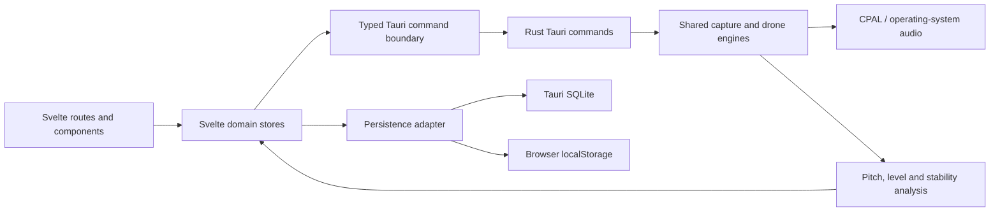

# ToneTrainer Runtime Architecture

## Repository Reality

ToneTrainer is an implemented desktop-first practice companion, not only a
product-definition prototype. The committed runtime consists of:

- a SvelteKit 5 and TypeScript frontend in `frontend/src/`;
- a Tauri 2 host in `frontend/src-tauri/`;
- a Rust/CPAL audio engine for capture, pitch analysis and drone playback;
- SQLite persistence in Tauri and a `localStorage` fallback in browser mode;
- product intent, mockups and active OpenSpec changes alongside the runtime.

The browser build is useful for UI development, but it does not prove desktop
microphone permissions, native device handling or Tauri IPC behavior.

## Runtime Boundaries

### Frontend

Routes and components render practice, ToneLab, progress, rhythm, teacher and
onboarding experiences. Domain stores coordinate session state, polling and
persisted preferences/history. Tauri runtime detection and the typed command
helper live in `frontend/src/lib/tauri/runtime.ts`; command argument/result
types live in `frontend/src/lib/types/tauri.ts`.

### Native host and audio

`frontend/src-tauri/src/lib.rs` is the native entrypoint and the canonical list
of exported commands. The audio modules own device discovery, stream lifecycle,
pitch detection, signal level calculation, stability analysis and drone output.
The host registers the SQL plugin and starts the audio processing loop.

### Persistence

`frontend/src/lib/db.ts` selects SQLite in Tauri and `localStorage` in browser
mode. These backends have different durability and failure characteristics;
browser fallback behavior must not be treated as evidence for SQLite behavior.

## Contracts and Verification

The Rust handler list and the TypeScript `TauriCommandMap` are checked by
`workflow/scripts/tauri-contract-check.sh`. All repository verification is
routed through `workflow/scripts/verify.sh` (`make verify` locally), with
frontend- and Rust-only modes used by CI. OpenSpec CI rejects implementation
diffs that do not include an active change artifact.

Dependency auditing is report-only while advisories are reviewed for actual
desktop exposure. The policy and current exceptions are documented in
`docs/dependency-audit.md`.

The main Tauri window receives `sql:default` for connection/read operations and
the explicit `sql:allow-execute` permission required for schema creation and
CRUD writes. `workflow/scripts/sqlite-capability-check.sh` verifies both the
least-privilege declaration and a deterministic create/read/update/delete
cycle. This capability-level evidence complements, but does not replace, a
packaged native application smoke.

Pull-request text is read as JSON data from `GITHUB_EVENT_PATH`. Implementation
pull requests declare exactly one `OpenSpec-Change: <active-id>` in their body;
the changed files must include that exact active change directory. Full local
verification also executes the governance injection, unrelated-change and
signature-drift negative tests.

## Delivery Architecture

Canonical governance is defined by `AGENTS.md`, active product/engineering
changes by `openspec/`, and workflow state by `workflow/`. Tool-specific files
and legacy `.specify/` content are adapters or historical reference, not new
operational truth.

## Known Verification Boundary

Automated unit and browser checks cannot replace a macOS desktop smoke test.
Microphone permission, device opening, sample receipt, stop/restart and device
loss require explicit native evidence before audio work is considered complete.
